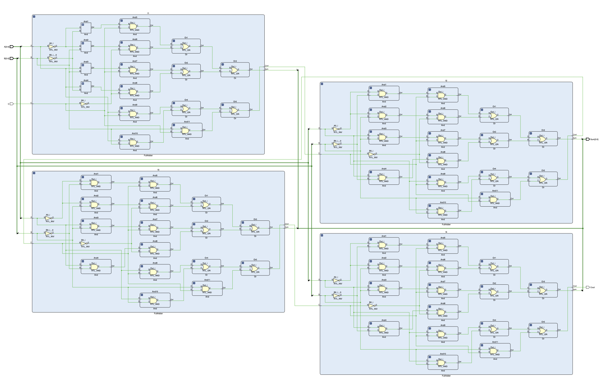

# Lab 2 Hexadecimal Full Adder :zap:

The purpose of this lab is to **review** and become familiar with the **design** and **testing** of combinational circuits using modular design (block symbols) in a computer-aided design tool. The circuit is to be designed and simulated in **XilinxVivado environment**. 

## Prelab
Using **soley two-input** `AND` gates and `OR` gates, implement a **Hexadecimal Adder** in a **modular** manner.
*  First, create **binary Full-adder** module:
   *  Write down the binary full adder **truth table**
   *  Demonstrate you know how to use **K-maps** to derive the SOP Boolean equations for Sum and Cout.
   *  Implement the obtained equations using **ONLY 2-input** `AND` and `OR` gates. Show the resulting **circuit**.
*  Now, create the Hexadecimal adder
   *  Using a **block diagram** representation of your full adder (corresponding to step 1 above) show how to connect enough instances of it to **Create a Hexadecimal adder** (Circuit that is able to add **one hexadecimal digit to another hexadecimal digit**). Show the resulting **circuit**.
* Bring a digital copy of your solution to your lab session

# Lab Outout

* Waveform


* Schematic
 

# Full-adder Module
```verilog
//FullAdder module of two bits 
module FullAdder(input A, input B, input C, output Sum, output Cout);

    //create wires to store and and or outputs
    wire a01,a02,a03,a04;
    wire a11,a12,a13,a14;
    wire o01, o02;
    //instantiate AND and OR gates for the SUM
    And And1(.A(~A),.B(~B),.Out(a01)); 
    And And2(.A(~A),.B(B),.Out(a02));
    And And3(.A(A),.B(B), .Out(a03));
    And And4(.A(A),.B(~B), .Out(a04));
    And And5(.A(a01),.B(C),.Out(a11));
    And And6(.A(a02),.B(~C),.Out(a12));
    And And7(.A(a03),.B(C),.Out(a13));
    And And8(.A(a04),.B(~C),.Out(a14));
    Or Or1(.A(a11),.B(a12),.Out(o01));
    Or Or2(.A(a13),.B(a14),.Out(o02));
    Or Or3(.A(o01),.B(o02),.Out(Sum));
    
    // instantiate AND and OR gates for the Cout
    wire c1,c2,c3,c4;
    And And9(.A(A),.B(C),.Out(c1));
    And And10(.A(A),.B(B),.Out(c2));
    And And11(.A(B),.B(C),.Out(c3));
    Or Or4(.A(c1),.B(c2),.Out(c4));
    Or Or5(.A(c4),.B(c3),.Out(Cout));
endmodule
```

# Hexadecimal Adder
```verilog
//Hexadecimal adder with two 4 bits inputs and 4 bits sum output 
module HexAdder(input [3:0]A, input[3:0]B, input C, output [3:0]Sum, output Cout);
    //create wire to store Cin output
    wire co, c1, c2;
    //instantiate Fulll-adder modules
    FullAdder f1(.A(A[0]),.B(B[0]),.C(C),.Sum(Sum[0]),.Cout(co));
    FullAdder f2(.A(A[1]),.B(B[1]),.C(co),.Sum(Sum[1]),.Cout(c1));
    FullAdder f3(.A(A[2]),.B(B[2]),.C(c1),.Sum(Sum[2]),.Cout(c2));
    FullAdder f4(.A(A[3]),.B(B[3]),.C(c2),.Sum(Sum[3]),.Cout(Cout));
    
endmodule  
```
# Software Development
| **Software** | **Environment** |
| :---:    | :---:       |
| ![Vivado](https://img.shields.io/static/v1?label=&message=Xilinx+Vivado&color=black&logo=data:image/png;base64,iVBORw0KGgoAAAANSUhEUgAAAEAAAABACAMAAACdt4HsAAABQVBMVEVeYABkZgB1dwB3eQCFhwCLjQmcniHS1CnV1zjX2Ufa3Fbl55Lo6qHq7Kzr7Vrr7bDt77%2Fu8Gn196v8%2FrT%2B%2F8P%2F%2F33%2F%2F9f%2F%2F%2F%2BLjQna3Fbl55Ll55La3Fbl55La3FaLjQna3Fbl55La3FaIigbl55Ll55KLjQmFhwCfoSba3FbZ21Ll55Ll55La3Fbl55LU1jTa3Fbl55L%2F%2F3ra3Fbl55La3Fba3Fbl55KLjQna3Fbl55La3Fbl55La3Fba3Fba3Fbl55KLjQn4%2Bq%2BLjQna3Fbl55Ll55Ll55KLjQna3Fbl55KLjQn196vb3Vzl55Ll55Ll55La3FZxcwB0dgDa3Fba3FaLjQna3Fba3FaLjQna3Fbl55KKjAeLjQnr7Wbl55La3Fba3FZ8fgCFhwCIigSLjQnX2Ufa3Fbl55Ln6Z3o6qFUKg%2FmAAAAYnRSTlMAAAAAAAAAAAAAAAAAAAAAAAAAAAAAAAAFCREVGBkgJSgoKS00NUFFRUVJSU1QUWFlZWVtcHl9fYGBgYWFiZObm5%2Bjr6%2BvtLe7u7u%2Fv8bLz9PX29vb3t%2Ff4%2Bfn5%2Bvr6%2B%2Fz99V9LS0AAAI%2BSURBVHjapdJlm9swDMDxZJ12TZxjZmZmvhszM7PnbN%2F%2FA8yt00dtJbdx%2FX9d%2FZ7IajDoWTAY1%2FYmdooCSi37Ae%2BU%2BuEFXCjdgQewq8rNtAxMKNMLRwBTlU49Ad1wS8A7hT1wA%2FAM2JYTgGfAvrsBeAbs0hGIFWnGF1BuwGtf4DYFJpyAcwrsOgFjFLhwAmIKvLfNRxroNrVyhqjYqYFCubAfnRc5gagzERoAU5XDnGGKA4qJqALQCXcosM5%2Bv2AA3ezPrwTYZ8YTwQML8lX%2FVj3wkR%2FngEdSvg27yf%2B5Zt6M88B9qYFCfxwP24FIL28DZKm3EJbOeWw5Q1RMrIDMAP0JpX4wZ8D1KTAkKwCERpghZ8BxCixIBMwSuks8Q%2BX2NuCGrAb0ElnfjYBfTwB8fgTMEqatDIhwnAGkrAVwCd2D8hnw8RlAUqDQEWXF0fAftYLrU2BIMkDQl5g627raujaftAsrsCAZ4MqAqJSIZPXf3%2FS6DTiSHBD04q9WU9PTeQ64JTkgwA84S6s6o8AXDsAFTtK67ozXAW8ZQC%2BA47TVpkAwwI5jDxsDZgFuHPu00QAoLfAwbdqJDXg5IO6luXo%2BxwG%2FP99M83aXA34tPc45fsavsHitR2yzA%2BSYLABXNSDE6LMc4xwAGaA7bDzOA4CAbuOT4z%2FxESBgYg66JoQNOAIKiNoH%2FTYihBVYAA7AB8VxHhgCAmCHZJwAAByA7U0LjAGAB2g8cB%2F8gEfgByyAD%2FBBToIXIAH8AM%2F%2BAwk%2BiPzFN%2BOgAAAAAElFTkSuQmCC%0A)| ![Verilog](https://img.shields.io/static/v1?label=&message=Verilog&color=blue&logo=data:image/png;base64,iVBORw0KGgoAAAANSUhEUgAAACAAAAAgCAMAAABEpIrGAAAABGdBTUEAALGPC%2FxhBQAAAAFzUkdCAK7OHOkAAAAgY0hSTQAAeiYAAICEAAD6AAAAgOgAAHUwAADqYAAAOpgAABdwnLpRPAAAAVZQTFRFAAAAAAAAAAAAAAAAAAAAAAAAAAAAAAAAAAAAAAAAAAAAAAAAAAAAAAAAAAAAAAAAAAAAAAAAAAAAAAAAAAAAAAAAAAAAAAAAAAAAAAAAAAAAAAAAAAAAAAAAAAAAAAAAAAAAAAAAAAAAAAAAAAAAAAAAAAAAAAAAAAAAAAAAAAAAAAAAAAAAAAAAAAAAAAAAAAAAAAAAAAAAAAAAAAAAAAAAAAAAAAAAAAAAAAAAAAAAAAAAAAAAAAAAAAAAAAAAAAAAAAAAAAAAAAAAAAAAAAAAAAAAAAAAAAAAAAAAAAAAAAAAAAAAAAAAAAAAAAAAAAAAAAAAAAAAAAAAAAAAAAAAAAAAAAAAAAAAAAAAAAAAAAAAAAAAAAAAAAAAAAAAAAAAAAAAAAAAAAAAAAAAAAAAAAAAAAAAAAAAAAAAAAAAAAAAAAAAAAAAAAAAAAAAAAAA%2F%2F%2F%2FyxSZEQAAAHB0Uk5TACDmwgk%2F%2B5dpllk088FTmnVzaPnPE7MFkpCcQuEewAe4Tt%2FFG2zlqAiD5%2BReJ3eMiGAMNX6NhFAEPn96K2H%2BgQJNvb6nZL8OR7DDxkXZ2AooItfa1tW7b9zd4N5qGkaHexyJbR1cSmu3ErKPm1JyWFVY6tcAAAABYktHRHGvB1ziAAAACXBIWXMAAA7EAAAOxAGVKw4bAAABf0lEQVQ4y92TWVOCUBiGKbG00lJLshCLFrVNrFxTs0NpUma2mEtGubQv5%2F9f9R2QxqkB7%2FsuzjMcHjjD8L4UBTM0bKIB5pFRcmXBFgIrHqO0GZ%2BwEcGOJ8nVFHaogvNHMLumZwBO7GYAs9hDNufUFykz72K9yrs5WnnUCqtvoU9Y5JeWASur%2FgAguBaENeBf39Dub26FhPA2tbMbicbiVCIZSSaoeCwa2kv1hHQGYzhjH2fIGVaAlaI5gHZGGvcErApYFbAmZA8QEg%2B9zFEOcZ68z8EhzuHLezgk2rPk%2FnGBkyTJJCIFCNkANoRMknQiFU7hc9xYZzLFM%2Bz2USVRTyiely9sJQPhcpCQubrGOSOBjPhfBLpiJFQgYjc8X61Wa3W2QcAqaLBsDcA3buFvMs07WRbuUw92QW61y51uS251O%2BV2SxYem4wSiDAkqm4QmMGRGxhaLfZPerGH4tT%2FFue5rzhQvReleq9q9d7I5nuf0Cvvh1bez9%2Fl1an%2FF8E34yTzLFjpmLMAAAAldEVYdGRhdGU6Y3JlYXRlADIwMjAtMDItMDdUMTc6MjQ6NDUrMDA6MDDiWEe%2BAAAAJXRFWHRkYXRlOm1vZGlmeQAyMDIwLTAyLTA3VDE3OjI0OjQ1KzAwOjAwkwX%2FAgAAAEZ0RVh0c29mdHdhcmUASW1hZ2VNYWdpY2sgNi43LjgtOSAyMDE5LTAyLTAxIFExNiBodHRwOi8vd3d3LmltYWdlbWFnaWNrLm9yZ0F74sgAAAAYdEVYdFRodW1iOjpEb2N1bWVudDo6UGFnZXMAMaf%2Fuy8AAAAYdEVYdFRodW1iOjpJbWFnZTo6aGVpZ2h0ADUxMsDQUFEAAAAXdEVYdFRodW1iOjpJbWFnZTo6V2lkdGgANTEyHHwD3AAAABl0RVh0VGh1bWI6Ok1pbWV0eXBlAGltYWdlL3BuZz%2ByVk4AAAAXdEVYdFRodW1iOjpNVGltZQAxNTgxMDk2Mjg13VzE4wAAABN0RVh0VGh1bWI6OlNpemUANy41M0tCQs3klRUAAABDdEVYdFRodW1iOjpVUkkAZmlsZTovLy4vdXBsb2Fkcy81Ni9zWnp0MUtzLzIxNDgvdmVyaWxvZ19pY29uXzEzMTg5NC5wbmc%2BkF9GAAAAAElFTkSuQmCC)|

## Author:
* [**Jesus Minjares**](https://github.com/jminjares4)
  * Master of Science in Computer Engineering 